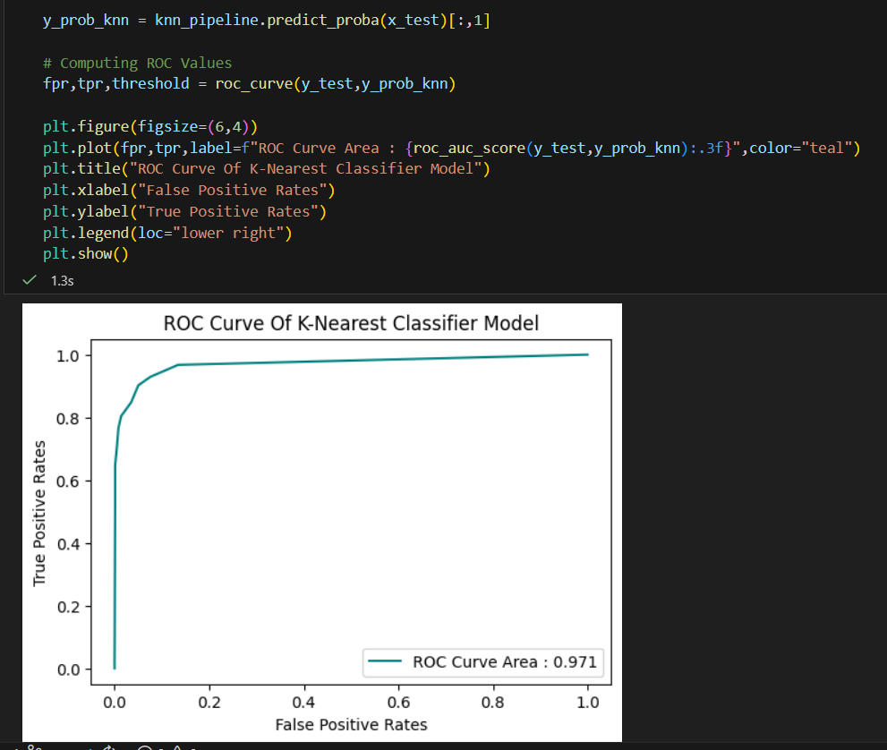

# 📊 Message Intelligence: Spam Classification Using Machine Learning

## 📌 Overview
This project focuses on detecting spam messages using different machine learning classification algorithms. The goal is to analyze message-related features and build models that can accurately classify messages as **Spam** or **Legitimate**.

## 📷 Project Screenshot

---

The project combines **probability concepts and machine learning models** such as KNN, SVM, and Naive Bayes to analyze message data and determine the best model for spam detection.

---

## 📂 Dataset
Dataset used: **Message Intelligence Dataset**

The dataset contains various numerical features extracted from messages, such as:

- Message length  
- Word count  
- Number of URLs  
- Number of digits and special characters  
- Spam keyword score  
- Legit keyword score  
- Sender activity score  
- Sender account age  
- Messages sent in the last 24 hours  
- Time-based features (hour of day, day of week)

**Target Variable**

`spam_label`

- **0 → Legitimate Message**
- **1 → Spam Message**

---

## ⚙️ Project Workflow

1. Data Loading  
2. Exploratory Data Analysis  
3. Data Preprocessing  
4. Feature Selection  
5. Train-Test Split  
6. Feature Scaling  
7. Model Implementation  
8. Model Evaluation  
9. Model Comparison

---

## 🤖 Machine Learning Models Implemented

### 1️⃣ K-Nearest Neighbors (KNN)
- Distance-based supervised learning algorithm
- Classifies messages based on the majority class of the nearest neighbors
- Performance depends on the value of **K**

---

### 2️⃣ Support Vector Machine (SVM)
- Margin-based classifier
- Finds the optimal hyperplane that separates spam and legitimate messages
- Implemented using **Linear and RBF kernels**

---

### 3️⃣ Naive Bayes
- Probabilistic classifier based on **Bayes' Theorem**
- Assumes that features are **conditionally independent**
- Works efficiently for classification tasks

---

## 📊 Model Evaluation Metrics

The models were evaluated using the following classification metrics:

- **Accuracy**
- **Precision**
- **Recall**
- **F1 Score**

These metrics help determine how effectively the models detect spam messages.

---

## 📈 Model Comparison

| Model | Description |
|------|-------------|
| KNN | Simple and intuitive but slower for large datasets |
| SVM | Provides strong classification performance and generalization |
| Naive Bayes | Fast probabilistic model suitable for large datasets |

Among the models tested, **Support Vector Machine (SVM)** generally showed the best performance for spam classification.

---

## 🧠 Key Insights

- **Naive Bayes** relies on probability assumptions and works well even with simplified feature independence.
- **KNN** performance depends heavily on the choice of K and distance metrics.
- **SVM** provides better decision boundaries by maximizing the margin between classes.

---

## 💼 Business Recommendation

For real-world spam detection systems, **Support Vector Machine (SVM)** is recommended because it provides strong classification performance and better generalization.

However, if the system requires **very fast predictions with minimal computational cost**, **Naive Bayes** can be used as a lightweight alternative.

---